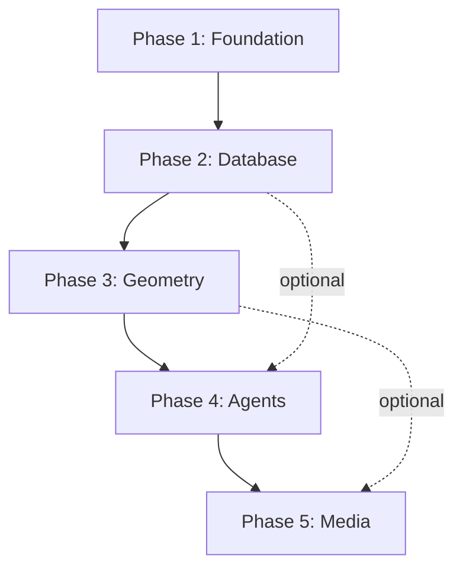

# Development Phases Roadmap

**Purpose:** Detailed breakdown of Gematria Hive development across 5 phases with milestones, dependencies, and success metrics.

**Last Updated:** November 6, 2025

---

## Phase Overview

| Phase | Name | Timeline | Status | Budget Estimate | Key Milestone |
|-------|------|----------|--------|-----------------|---------------|
| **Phase 1** | Foundation & Calculator | ✅ Complete | ✅ Done | $0 | Basic app running on Replit |
| **Phase 2** | Database & Word Index | Q1 2026 | 🔄 Planning | $25-50/mo | 1M+ words searchable with embeddings |
| **Phase 3** | Sacred Geometry & Proofs | Q2 2026 | 📋 Planned | $100-200/mo | First mathematical proof generated |
| **Phase 4** | Full MCP/Agents | Q3 2026 | 📋 Planned | $200-500/mo | Autonomous research agent operational |
| **Phase 5** | Expansion & Generative Media | Q4 2026 | 📋 Planned | $500+/mo | Public launch with game/media features |

---

## Phase 1: Foundation & Calculator ✅ COMPLETE

**Goal:** Build functional gematria calculator and establish development environment.

**Timeline:** November 2025 (1 week) ✅

**Status:** ✅ Complete as of Nov 6, 2025

### Deliverables

- [x] Streamlit web application
- [x] Basic gematria calculator (Standard & Reduced methods)
- [x] UI with navigation (Calculator, About, Setup Guide)
- [x] Project documentation (README, replit.md)
- [x] Development environment (Python 3.11, Replit workflow)
- [x] Deployment configuration (autoscale)
- [x] Environment templates (.env.example)
- [x] Git repository setup

### Technologies Implemented

| Technology | Purpose | Status |
|------------|---------|--------|
| Python 3.11 | Runtime | ✅ Active |
| Streamlit 1.51.0+ | Web framework | ✅ Active |
| Pandas 2.3.3+ | Data handling | ✅ Active |
| Replit | Hosting & deployment | ✅ Active |

### Success Metrics

- ✅ App loads without errors
- ✅ Calculator produces correct results (verified: "LOVE" = 54 standard, 18 reduced)
- ✅ Responsive UI on desktop/mobile
- ✅ Deployment configured
- ✅ Documentation complete

### Lessons Learned

1. **Replit proxy configuration is critical** - Must disable CORS/XSRF for iframe
2. **Start with minimal dependencies** - Avoid heavy ML libs in Phase 1 (timeout issues)
3. **Distinct calculation methods matter** - Initial implementation had duplicate methods (fixed)
4. **Architect reviews catch errors** - Saved time by catching logic bugs early

### Cost Actual

- **$0/mo** (Replit free tier sufficient)

### Blockers Encountered

- ✅ RESOLVED: Initial pip install timeout (switched to packager tool)
- ✅ RESOLVED: Duplicate calculation methods (implemented Pythagorean reduction)

### Next Phase Handoff

**Prerequisites for Phase 2:**
- [ ] Secure Supabase account and configure credentials
- [ ] Source gematrix.org 1M+ word CSV (scrape or request bulk export)
- [ ] Design database schema for word index
- [ ] Plan embedding strategy (model selection, storage)

---

## Phase 2: Database & Word Index 🔄 IN PLANNING

**Goal:** Ingest 1M+ words with gematria values, enable semantic search, add advanced calculation methods.

**Timeline:** Q1 2026 (Est. 4-6 weeks)

**Status:** 🔄 Planning stage

### Key Deliverables

- [ ] Supabase PostgreSQL + pgvector integration
- [ ] 1M+ word database with gematria values
- [ ] Word lookup by value (reverse search)
- [ ] Embedding-based semantic search ("words similar to X")
- [ ] Advanced gematria methods (Hebrew, Greek, Full)
- [ ] Phonetic analysis integration
- [ ] Etymology data (basic)
- [ ] Data ingestion pipeline (Pixeltable)
- [ ] Automated testing suite (pytest)

### Technology Stack

| Technology | Purpose | Reason | Est. Cost |
|------------|---------|--------|-----------|
| **Supabase** | Database + pgvector | Managed Postgres, free tier, vector search | $0-25/mo |
| **Pixeltable** | Data pipeline | Unified multimodal workflows | Compute only |
| **sentence-transformers** | Embeddings | Local inference, all-MiniLM-L6-v2 model | Compute only |
| **pytest** | Testing | Industry standard, catch regressions | $0 |
| **black + mypy** | Code quality | Auto-format, type safety | $0 |

### Database Schema (Preliminary)

```sql
-- Words table
CREATE TABLE words (
  id BIGSERIAL PRIMARY KEY,
  word TEXT UNIQUE NOT NULL,
  standard_value INTEGER,
  reduced_value INTEGER,
  hebrew_value INTEGER,
  greek_value INTEGER,
  phonetic TEXT,
  etymology TEXT,
  embedding VECTOR(384),  -- pgvector for semantic search
  created_at TIMESTAMPTZ DEFAULT NOW()
);

-- Index for fast gematria lookups
CREATE INDEX idx_standard_value ON words(standard_value);
CREATE INDEX idx_reduced_value ON words(reduced_value);

-- Index for vector similarity search
CREATE INDEX idx_embedding ON words USING ivfflat (embedding vector_cosine_ops);

-- Permutations table (for anagrams, letter rearrangements)
CREATE TABLE permutations (
  id BIGSERIAL PRIMARY KEY,
  word_id BIGINT REFERENCES words(id),
  permutation TEXT,
  created_at TIMESTAMPTZ DEFAULT NOW()
);

-- User searches log (for analytics)
CREATE TABLE search_log (
  id BIGSERIAL PRIMARY KEY,
  search_term TEXT,
  search_type TEXT, -- 'by_word', 'by_value', 'semantic'
  results_count INTEGER,
  created_at TIMESTAMPTZ DEFAULT NOW()
);
```

### Data Ingestion Strategy

1. **Source Data:**
   - Primary: gematrix.org CSV (1M+ words)
   - Backup: WordNet, custom word lists
   - Check ToS, consider contacting gematrix.org for official export

2. **Pipeline:**
   ```
   CSV → Pixeltable → Clean/Transform → Generate Embeddings → Supabase
   ```

3. **Embedding Generation:**
   - Model: `all-MiniLM-L6-v2` (384 dimensions, 120MB, fast)
   - Batch size: 1000 words at a time
   - Estimate: ~2-3 hours for 1M words on Replit
   - Cache embeddings to avoid re-computation

4. **Validation:**
   - Spot-check 100 random words for correct values
   - Test semantic search: "king" should find "queen", "monarch"
   - Performance: <100ms lookup by value, <500ms semantic search

### Milestones

| Milestone | Est. Date | Dependencies | Success Criteria |
|-----------|-----------|--------------|------------------|
| M1: Database setup | Week 1 | Supabase account | Tables created, pgvector enabled |
| M2: CSV ingestion | Week 2 | M1, CSV sourced | 1M+ rows in DB |
| M3: Embeddings | Week 3 | M2, model selected | All words have embeddings |
| M4: Search features | Week 4 | M3 | Reverse search + semantic working |
| M5: UI updates | Week 5 | M4 | New features in Streamlit |
| M6: Testing & polish | Week 6 | M5 | pytest suite, zero critical bugs |

### Risk & Mitigation

| Risk | Impact | Probability | Mitigation |
|------|--------|-------------|------------|
| gematrix.org blocks scraping | **HIGH** | Medium | Contact site owner, use backup word lists |
| Supabase free tier too small | MEDIUM | Low | Upgrade to Pro ($25/mo) if needed |
| Embedding generation slow | MEDIUM | Medium | Use cloud GPU (Colab), batch processing |
| pgvector performance issues | MEDIUM | Low | Tune index parameters, limit result count |

### Success Metrics

- [ ] 1M+ words in database
- [ ] <100ms average lookup time by value
- [ ] <500ms semantic search (top 10 results)
- [ ] 95%+ uptime on Replit deployment
- [ ] Zero critical bugs in prod
- [ ] pytest coverage >80%

### Cost Estimate

- Supabase: $0-25/mo (start free, upgrade if needed)
- Compute: Replit free tier likely sufficient
- **Total: $0-25/mo**

### Things to Watch

1. **Supabase storage limits** - Free tier: 500MB. Monitor DB size.
2. **Embedding dimensionality** - 384 dims = good balance. Consider 768 if accuracy matters.
3. **Rate limits** - Replit free tier may throttle heavy queries. Cache aggressively.
4. **Data quality** - Gematrix.org may have errors. Validate sample before full import.

### Optional Enhancements (If Time Allows)

- [ ] Anagram finder (words with same gematria value)
- [ ] Word associations graph (visualize semantic connections)
- [ ] Export results to CSV/PDF
- [ ] API endpoint for programmatic access
- [ ] Multi-language support (UI in Spanish, Hebrew, etc.)

---

## Phase 3: Sacred Geometry & Proofs 📋 PLANNED

**Goal:** Build mathematical proof system connecting gematria to sacred geometry, harmonics, and physics.

**Timeline:** Q2 2026 (Est. 8-10 weeks)

**Status:** 📋 Not started

### Key Deliverables

- [ ] SymPy integration for symbolic math
- [ ] 2D-5D geometric visualizations
- [ ] Proof generation system (theorem → report)
- [ ] Harmonic/frequency analysis
- [ ] Pi, Phi, 369 pattern detection
- [ ] ClickHouse analytics database (optional)
- [ ] StringZilla/SimSIMD optimization
- [ ] Interactive geometry explorer (Plotly)

### Technology Stack

| Technology | Purpose | Reason | Est. Cost |
|------------|---------|--------|-----------|
| **SymPy** | Symbolic math | Theorem proving, geometry | $0 |
| **Plotly** | Visualization | Interactive 3D, web-friendly | $0 |
| **ClickHouse** | Analytics DB | OLAP for pattern discovery | $0-100/mo |
| **StringZilla** | String ops | 10x faster text processing | $0 |
| **SimSIMD** | Vector ops | Hardware-accelerated similarity | $0 |

### Research Areas

1. **Gematria-Geometry Unification:**
   - Map letter values to geometric coordinates
   - Detect symmetries in word-value distributions
   - Identify Fibonacci, Golden Ratio patterns

2. **Harmonic Analysis:**
   - Convert gematria values to frequencies
   - Detect Schumann resonance correlations
   - Cymatics pattern matching

3. **Dimensional Bridging:**
   - 2D: Letter pair relationships
   - 3D: Word triplet geometries
   - 4D: Temporal gematria evolution
   - 5D: Multi-language convergence

4. **Proof System:**
   - Input: Hypothesis (e.g., "369 appears in prime gematria values")
   - Process: SymPy + data mining + statistical tests
   - Output: Markdown report with accuracy score

### Milestones

| Milestone | Est. Date | Dependencies | Success Criteria |
|-----------|-----------|--------------|------------------|
| M1: SymPy setup | Week 1 | Phase 2 complete | Basic proofs working |
| M2: Geometry viz | Weeks 2-3 | M1 | 2D/3D plots rendering |
| M3: Pattern detection | Weeks 4-5 | M2, ClickHouse | Find 3+ patterns |
| M4: Proof engine | Weeks 6-7 | M3 | Generate first full report |
| M5: UI integration | Week 8 | M4 | Proofs browsable in Streamlit |
| M6: Optimization | Weeks 9-10 | M5 | StringZilla/SimSIMD integrated |

### Success Metrics

- [ ] Generate 10+ validated mathematical proofs
- [ ] Detect at least 3 novel gematria-geometry patterns
- [ ] Interactive 3D visualizations load <2 seconds
- [ ] Proof accuracy >90% (validated by external review)
- [ ] User engagement: avg 5+ min per session

### Cost Estimate

- ClickHouse: $0-100/mo (self-hosted free, cloud for scale)
- Compute: May need Replit Hacker ($7/mo) for RAM
- **Total: $7-107/mo**

### Constraints

- Heavy compute for geometry rendering
- May need GPU for advanced visualizations (Omniverse deferred to Phase 5)
- SymPy proofs can be slow; need caching

### Future-Proofing

- Keep visualization layer abstract (easy to swap Plotly → Three.js)
- Store proofs in structured JSON (machine-readable)
- Design for reproducibility (version proofs with git)

---

## Phase 4: Full MCP/Agents 📋 PLANNED

**Goal:** Implement autonomous agent system for research, inference, proof generation, and opportunity discovery.

**Timeline:** Q3 2026 (Est. 10-12 weeks)

**Status:** 📋 Not started

### Key Deliverables

- [ ] LangChain/LangGraph agent framework
- [ ] Multi-agent orchestration (MCP protocol)
- [ ] Autonomous research agent (DeepAnalyze)
- [ ] Proof validation agent
- [ ] Opportunity discovery agent (quantum leaps)
- [ ] Memory system (persistent context)
- [ ] Cost tracking and optimization
- [ ] Agent performance evals (ProfBench)
- [ ] Qiskit quantum simulation (experimental)

### Technology Stack

| Technology | Purpose | Reason | Est. Cost |
|------------|---------|--------|-----------|
| **LangChain** | Agent framework | Industry standard | $50-200/mo (API) |
| **LangGraph** | Stateful workflows | Better than raw LangChain | Included |
| **DeepAgents** | Advanced autonomy | Research-grade agents | TBD |
| **OpenAI/Anthropic** | LLM backend | GPT-4 / Claude | $100-300/mo |
| **Qiskit** | Quantum sim | Quantum-inspired algorithms | $0 (free sim) |
| **ProfBench** | Evals | Accuracy measurement | TBD |

### Agent Architecture

```
┌─────────────────────────────────────────────────────┐
│              MCP Orchestrator                       │
│  (LangGraph state machine, task routing)            │
└───────────┬─────────────────────────────────────────┘
            │
    ┌───────┴───────┬──────────┬──────────┬──────────┐
    │               │          │          │          │
┌───▼────┐  ┌──────▼─┐  ┌─────▼──┐  ┌────▼───┐  ┌──▼────┐
│Research│  │ Proof  │  │Pattern │  │Quantum │  │Report │
│ Agent  │  │Validate│  │Discover│  │ Leap   │  │ Gen   │
│(Analyze│  │ Agent  │  │ Agent  │  │ Agent  │  │Agent  │
└────────┘  └────────┘  └────────┘  └────────┘  └───────┘
     │           │           │           │           │
     └───────────┴───────────┴───────────┴───────────┘
                         │
                  ┌──────▼──────┐
                  │   Memory    │
                  │  (Supabase) │
                  └─────────────┘
```

### Agent Capabilities

1. **Research Agent:**
   - Query databases for patterns
   - Synthesize findings into hypotheses
   - Generate research questions

2. **Proof Validation Agent:**
   - Check mathematical rigor
   - Identify logical errors
   - Score proof accuracy (0-100%)

3. **Pattern Discovery Agent:**
   - Mine data for novel correlations
   - Detect synchronicities
   - Flag high-confidence findings

4. **Quantum Leap Agent:**
   - Propose unconventional connections
   - Use Qiskit for quantum-inspired search
   - High creativity, lower accuracy (experimental)

5. **Report Generation Agent:**
   - Compile findings into human-readable reports
   - Generate visualizations
   - Export to PDF/HTML

### MCP Protocol

- **Task routing:** Orchestrator assigns tasks based on agent specialty
- **State management:** LangGraph tracks task progress, checkpoints
- **Memory:** Persistent context stored in Supabase (agent_memory table)
- **Cost control:** Budget limits per agent, auto-pause on threshold

### Milestones

| Milestone | Est. Date | Dependencies | Success Criteria |
|-----------|-----------|--------------|------------------|
| M1: LangChain setup | Weeks 1-2 | Phase 3 complete | Basic agent working |
| M2: Multi-agent | Weeks 3-4 | M1 | 3+ agents cooperating |
| M3: Memory system | Week 5 | M2 | Context persists 24h+ |
| M4: Proof agent | Weeks 6-7 | M3 | Validate 10+ proofs |
| M5: Quantum leap | Weeks 8-9 | M4 | Generate 3+ novel hypotheses |
| M6: Evals & polish | Weeks 10-12 | M5 | ProfBench score >80% |

### Success Metrics

- [ ] Agents generate 50+ research hypotheses
- [ ] 20+ validated proofs produced autonomously
- [ ] <$300/mo API costs (cost-optimized prompts)
- [ ] Agent accuracy >80% (ProfBench)
- [ ] Zero infinite loops or runaway costs

### Cost Estimate

- LLM APIs: $100-300/mo (GPT-4 / Claude)
- Replit: Upgrade to Hacker ($7/mo) or Pro ($20/mo)
- **Total: $107-320/mo**

### Risk & Mitigation

| Risk | Impact | Mitigation |
|------|--------|------------|
| Runaway API costs | **HIGH** | Hard budget limits, alerts at 80% |
| Agent hallucinations | MEDIUM | Validation layer, human-in-loop for critical proofs |
| Slow inference | MEDIUM | Use GPT-3.5 for simple tasks, GPT-4 for complex |
| Memory leaks | LOW | Clear context every 100 tasks |

### Things to Watch

- API rate limits (OpenAI: 3500 req/min, Anthropic: 1000 req/min)
- Prompt token usage (optimize with caching)
- Agent task times (set timeouts to avoid hangs)
- False positive rate in pattern discovery

### Future-Proofing

- Design agents to be LLM-agnostic (easy swap GPT → Llama)
- Store agent logs for fine-tuning (Tinker/ADP in Phase 5)
- Keep MCP protocol standard-compliant for interop

---

## Phase 5: Expansion & Generative Media 📋 PLANNED

**Goal:** Public launch, generative media (videos/games), scaling, monetization.

**Timeline:** Q4 2026+ (Ongoing)

**Status:** 📋 Not started

### Key Deliverables

- [ ] Public website launch
- [ ] Generative game level creator (369 proofs → Pygame/Godot)
- [ ] Educational videos (SymPy proofs → animation)
- [ ] Community features (user submissions, voting)
- [ ] API for developers
- [ ] Mobile app (optional)
- [ ] Advanced 3D viz (Omniverse, if budget allows)
- [ ] Monetization (premium features, API tiers)

### Technology Stack

| Technology | Purpose | Reason | Est. Cost |
|------------|---------|--------|-----------|
| **Pygame** | 2D games | Simple, fast prototyping | $0 |
| **Godot** | 3D games | Open-source game engine | $0 |
| **Omniverse** | High-end 3D | NVIDIA simulation platform | $500+/mo |
| **Stripe** | Payments | Industry standard | 2.9% + 30¢ |
| **Vercel/Cloudflare** | CDN | Global distribution | $0-20/mo |

### Generative Media Examples

1. **Game: 369 Proof Explorer**
   - Input: Gematria theorem (e.g., "369 divine pattern")
   - Output: Procedurally generated puzzle game
   - Style: Puzzle-platformer with sacred geometry aesthetics

2. **Video: "The Hidden Math of Language"**
   - SymPy proof → animated explainer
   - Narration via text-to-speech (ElevenLabs)
   - Export to YouTube

3. **Interactive Proof Viewer**
   - 3D visualization of multi-dimensional proofs
   - VR support (optional)

### Milestones

| Milestone | Est. Date | Dependencies | Success Criteria |
|-----------|-----------|--------------|------------------|
| M1: Public beta | Month 1 | Phase 4 complete | 100+ users |
| M2: Game prototype | Month 2 | M1 | First playable game |
| M3: Video production | Month 3 | M2 | 3+ explainer videos |
| M4: API launch | Month 4 | M3 | 10+ developer signups |
| M5: Monetization | Month 5 | M4 | First paying customer |
| M6: Scale | Ongoing | M5 | 1000+ MAU |

### Success Metrics

- [ ] 1000+ monthly active users
- [ ] 10+ generative games created
- [ ] 100K+ video views
- [ ] 50+ API customers
- [ ] $1000+/mo revenue

### Cost Estimate

- Infrastructure: $100-500/mo (scaling Supabase, ClickHouse, CDN)
- API costs: $200-500/mo (usage-based)
- Media production: $100/mo (ElevenLabs, stock assets)
- **Total: $400-1100/mo**
- **Revenue target: $1000+/mo** (break-even M5-6)

### Monetization Strategy

1. **Freemium Model:**
   - Free: 10 searches/day, basic calculator
   - Premium ($9.99/mo): Unlimited searches, API access, advanced proofs

2. **API Tiers:**
   - Hobby: 1000 req/mo free
   - Pro: $29/mo for 100K req
   - Enterprise: Custom pricing

3. **Consulting:**
   - Custom proof generation services
   - Sacred geometry consulting for artists/architects

### Things to Watch

- User acquisition cost (CAC)
- Churn rate (target <5%/mo)
- Infrastructure costs vs. revenue
- Competitor analysis (similar gematria tools)

### Future-Proofing

- Design API with versioning (v1, v2, ...)
- Keep games/media portable (avoid platform lock-in)
- Build community early (Discord, newsletter)

---

## Cross-Phase Dependencies



**Critical path:** P1 → P2 → P3 → P4 → P5  
**Optional shortcuts:** Can start Phase 4 agents with Phase 2 data (skip Phase 3 geometry for MVP)

---

## Global Success Metrics

| Metric | Phase 2 | Phase 3 | Phase 4 | Phase 5 |
|--------|---------|---------|---------|---------|
| **Monthly Active Users** | 10+ | 50+ | 200+ | 1000+ |
| **Database Size** | 1M+ words | +10M patterns | +1M proofs | +100M interactions |
| **API Usage** | N/A | N/A | 10K req/mo | 1M req/mo |
| **Revenue** | $0 | $0 | $0-100 | $1000+ |
| **Cost** | $0-25 | $7-107 | $107-320 | $400-1100 |

---

## Update Log

| Date | Change | Rationale |
|------|--------|-----------|
| 2025-11-06 | Initial roadmap created | Structured planning for 5-phase development |
| TBD | Phase 2 kickoff | Update with actual start date and sprint plan |

---

**Next Steps:**
1. Review and approve Phase 2 plan
2. Set up Supabase account and credentials
3. Source gematrix.org CSV
4. Create Phase 2 sprint backlog in `staging/sprints/`
